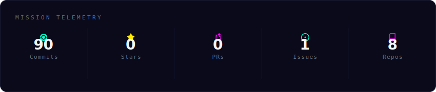

<!-- Galaxy Profile README — Abhijit Karale
     Generated with the Galaxy Profile README generator (see GENERATOR_README.md).
     The SVGs below are auto-generated by the GitHub Actions workflow
     (.github/workflows/generate-profile.yml) or by running:
       python -m generator.main generate
     using config.yml as the source of truth. -->

  

 

  

 

  

 

  

 

<strong>More about me</strong>

 

RTL Design & Verification Engineer in training with 2+ years of embedded systems and
hardware design experience. Built a 5-stage pipelined RISC-V processor in Verilog/UVM
achieving 95%+ functional coverage, plus six additional high-impact RTL/DV and hardware
projects spanning AMBA-APB, UART, FIFO/CDC, and formal verification (SVA, JasperGold).

Currently advancing SoC architecture, layered UVM testbenches, and DPI skills through
The Silicon Sandbox's Advanced RTL Design & Verification program (completion: December 2026).
Certified by Maven Silicon, ChipXpert, IIT (BHU) Varanasi, and The Silicon Sandbox.

**Currently at** Velastra Pvt. Ltd. — Ahmedabad, Gujarat, India

 

  
  

